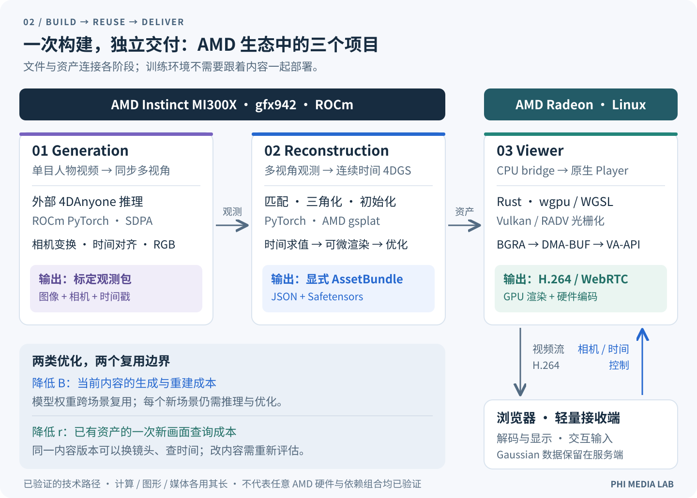
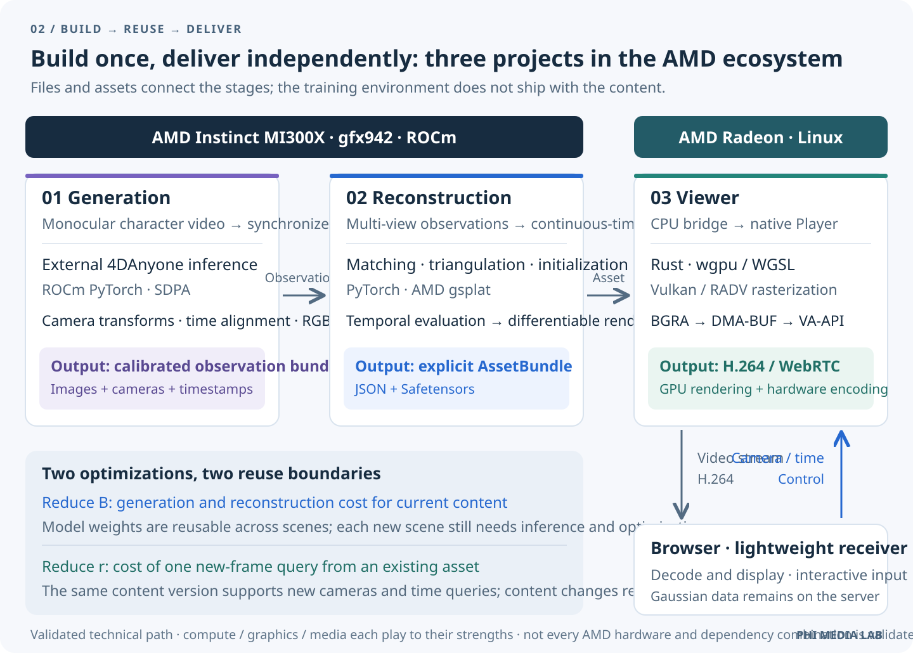

# 让 Physical AI 看懂动态世界：在 AMD ROCm 上用单目视频构建 4DGS

> **Phi Media Lab + rocPAI-Lab 联合实践**

**语言 / Language:** [中文](#中文) · [English](#english) · ⏱️ ~3 min read

---

## 中文

### Physical AI 的动态世界表示

Physical AI 的核心问题，不只是生成像素，而是让系统感知、重建并持续查询一个正在变化的真实世界。传统 4DGS 通常从同步、标定的多视角视频开始；本文探索一条更低采集门槛的路径：从单目视频出发，通过 4D 视频生成模型补充同步多视角观测，构建可查询的 4DGS 动态世界表示。

这条管线在 rocPAI-Forge 的 Physical AI 方向中承担的是“动态视觉层”：

```text
单目视频 → 生成式多视角 → 4DGS 动态世界表示
         → 机器人观测 / 仿真 / 策略训练 → 真机验证
```

4DGS 不是最终控制器，也不是完整物理仿真器。它表达的是世界在空间和时间上如何呈现；碰撞、摩擦、接触动力学和关节控制仍需要 MuJoCo、Isaac Sim 或其他物理与机器人系统。

### 我们跑通了什么

把一段人物视频变成可以自由改变视角的动态场景，需要的不只是一个生成模型。传统 4DGS 通常依赖同步、标定的多视角视频；Phi Media Lab 与 rocPAI-Lab 探索了一条更低采集门槛的路径：从**单目视频**出发，在 **AMD Instinct MI300X + ROCm** 上用 4D 视频生成模型补充同步多视角观测，再完成 4D Gaussian 重建，最后由 **AMD Radeon** 节点完成 Vulkan 渲染、VA-API H.264 编码与 WebRTC 交付。

这不是把生成视角当成真实摄像头阵列，而是用模型预测的多视角观测替代一部分采集硬件：以更低的采集、同步和标定门槛，换取额外的生成计算与几何一致性验证成本。

一次端到端实验完成了：

- 一段单目人物视频的 121 帧区间 → 24 路、2,904 张 `704×1280` 多视角观测
- 初始化 499,972 个动态 Gaussian，完成 30,000 次参数更新
- 导出可独立部署的 AssetBundle
- 在 Radeon 上输出 `1280×720` 动态画面，并由 Chrome 通过 WebRTC 接收

这不是跨平台 benchmark，而是我们验证过的具体软硬件组合和执行路径。


*动态渲染演示：AMD Radeon Viewer 随相机轨迹和归一化时间变化渲染 4DGS。素材来自 [4DGS Viewer Phi](https://github.com/phi-media-lab/4dgs-viewer-Phi)，仅分发渲染结果，不分发源视频或 Gaussian 资产。*

### 为什么要做可复用资产

固定视频只需要交付已经确定的像素；自由视角浏览、重复镜头设计则需要根据相机和时间不断查询同一份内容。4DGS 把动态场景保存为可查询的显式表示，让构建成本可以在多次交互中摊销：

```text
直接生成：  C_gen(N)   = gN
资产路线：  C_asset(N) = B + rN
```

这里 `B` 是生成与重建成本，`r` 是一次查询的渲染成本。资产路线不天然更便宜，但当内容被反复查询且 `g > r` 时，它提供了明确的工程价值。

### 三个项目组成一条管线

1. **Generation**：[`4DGS Generation Phi`](https://github.com/phi-media-lab/4dgs-generation-Phi) 接受单目人物视频，接入锁定版本的 [`4DAnyone`](https://github.com/ant-research/4DAnyone)，生成带 RGB、相机参数和时间戳的同步多视角观测。
2. **Reconstruction**：[`4DGS Reconstruction Phi`](https://github.com/phi-media-lab/4dgs-reconstruction-Phi) 通过匹配、三角化和可微渲染，优化连续时间 Gaussian 表示。
3. **Viewer**：[`4DGS Viewer Phi`](https://github.com/phi-media-lab/4dgs-viewer-Phi) 使用 Rust、wgpu/WGSL、Mesa RADV/Vulkan 和 VA-API/GStreamer，把显式资产变成 WebRTC 视频。

生成与重建在 MI300X/ROCm 上生产资产；Viewer 不需要训练环境，只消费 AssetBundle。图形与媒体侧的 GPU 共享减少了不必要的 CPU 往返，但网络传输和浏览器解码仍然存在。



### ROCm 上的关键实践

- 生成侧使用 ROCm PyTorch 和 SDPA。
- 重建侧锁定 `gfx942`，使用 AMD-Ecosystem `gsplat` 的可微渲染路径。
- 动态 Gaussian 采用连续 struct-of-arrays 张量组织，时间求值向量化。
- 一次 FP16 前景分割路径触发 rocBLAS 故障后，我们只将该支路调整为 FP32，没有把整个系统统一改成单一精度。

### 从一次实践到可交互动态内容

MP4 解决的是“如何封装和播放已经确定的像素”；4DGS 探索的是另一种内容交付边界：把动态场景保存为可以由相机和时间查询的资产。未来如果资产格式、压缩、跨平台渲染和客户端生态逐步成熟，4DGS 有机会成为可交互动态内容的基础资产形态，但它不会简单取代固定播放和低带宽分发仍然占优的 MP4。

对内容生产者，这意味着一次采集和重建可以服务多条镜头轨迹、自由视角浏览、XR、数字人和商品展示。对平台，这意味着可以围绕动态资产提供托管、版本管理、云端渲染、视角查询和 WebRTC 交付，而不是为每个新镜头重复生成完整视频。用户看到的也不再只是作者预先剪好的镜头，而是可以探索的时空内容。

对机器人，4DGS 更适合被定位为**动态视觉层**：它可以从真实视频构建可查询的时空观测，用于不同相机位姿下的数据生成、动作回放、遮挡检查、视觉定位和策略数据补充。但它不是完整物理仿真器，不能独立提供碰撞、摩擦、接触动力学、关节控制或对未观测动作的可靠预测。更现实的路径是：

```text
真实视频 → 4DGS 动态视觉资产 → 机器人观测 / 数据生成
         → 物理仿真与策略训练 → 真机验证
```

从研究表示走向产业格式，还需要稳定的资产 schema、压缩与流式传输、跨 GPU 渲染、质量验证、版权 / 来源追踪和终端生态。短期内，4DGS 更可能先以应用内部资产、云端渲染格式或机器人数据中间表示落地。

### 结果与边界

这次闭环证明了生成、重建、资产导出和交互交付可以在验证过的 AMD 组合上串起来，但没有证明所有质量问题已经解决。发丝、快速运动和未见视角仍可能出现模糊与拖影；生成视角的指标也不能替代真实多机位验证。目前 Viewer 验证的是单用户局域网路径，不是多租户生产服务。

下一篇将展开 MI300X 上的动态 Gaussian 初始化、可微渲染训练，以及几何问题和性能问题如何分开验证。

项目入口：[`Generation`](https://github.com/phi-media-lab/4dgs-generation-Phi) · [`Reconstruction`](https://github.com/phi-media-lab/4dgs-reconstruction-Phi) · [`Viewer`](https://github.com/phi-media-lab/4dgs-viewer-Phi)

---

## English

### A dynamic-world representation for Physical AI

Physical AI is not only about generating pixels; it is about sensing, reconstructing, and querying a changing real world. Conventional 4DGS commonly starts from synchronized, calibrated multi-view video. This article explores a lower-capture-barrier path: start from monocular video, synthesize synchronized multi-view observations with a 4D video-generation model, and build a queryable 4DGS representation of the dynamic world.

Within rocPAI-Forge’s Physical AI direction, this pipeline is a **dynamic visual layer**:

```text
monocular video → generative multi-view → 4DGS dynamic-world representation
                 → robot observations / simulation / policy training → real-robot validation
```

4DGS is neither the final controller nor a complete physics simulator. It represents how the world appears to change in space and time; collision, friction, contact dynamics, and joint control still belong to systems such as MuJoCo, Isaac Sim, or other robotics and physics stacks.

### What we built

Turning a character video into a dynamic scene that can be viewed from changing cameras takes more than a video-generation model. Conventional 4DGS commonly starts from synchronized, calibrated multi-view video. **Phi Media Lab + rocPAI-Lab** explored a lower-capture-barrier path: start from a **monocular video**, use a 4D video-generation model on **AMD Instinct MI300X + ROCm** to synthesize synchronized multi-view observations, reconstruct 4D Gaussians, and then use an **AMD Radeon** node for Vulkan rendering, VA-API H.264 encoding, and WebRTC delivery.

This does not treat generated views as equivalent to real cameras. It trades lower capture, synchronization, and calibration overhead for additional generation compute and multi-view consistency validation.

One end-to-end run produced 24 views and 2,904 `704×1280` observations from a 121-frame monocular character-video interval, initialized 499,972 dynamic Gaussians, ran 30,000 updates, exported an AssetBundle, and delivered `1280×720` motion to Chrome over WebRTC.

This is a result from one validated software and hardware path, not a cross-platform benchmark.


*Dynamic rendering preview: the AMD Radeon Viewer renders 4DGS while camera trajectory and normalized time change. The media comes from [4DGS Viewer Phi](https://github.com/phi-media-lab/4dgs-viewer-Phi); only the rendered result is distributed, not the source video or Gaussian asset.*

### Why a reusable asset matters

A fixed video delivers known pixels. Free-viewpoint browsing and repeated camera design query the same content with changing camera and time parameters. A 4DGS asset makes that content reusable:

```text
generate every frame: C_gen(N)   = gN
build an asset first:  C_asset(N) = B + rN
```

`B` is the generation and reconstruction cost; `r` is the cost of one rendered query. The asset path is not automatically cheaper, but it becomes attractive when the content is queried repeatedly and `g > r`.

### Three projects, one pipeline

**Generation** accepts a monocular character video and produces synchronized multi-view observations. **Reconstruction** optimizes a continuous-time Gaussian representation. **Viewer** consumes the exported AssetBundle and uses Rust, wgpu/WGSL, Mesa RADV/Vulkan, and VA-API/GStreamer to deliver a WebRTC stream.

The MI300X/ROCm side builds the asset; the Radeon viewer does not need the training environment. GPU sharing avoids an unnecessary full-frame CPU round trip, while network transport and browser decoding remain part of the end-to-end path.



### From one pipeline to interactive dynamic content

MP4 packages and plays already-determined pixels. 4DGS explores a different delivery boundary: a dynamic scene asset queried by camera and time. If asset schemas, compression, cross-platform rendering, and client support mature, 4DGS could become a foundation for interactive dynamic content. It would not simply replace MP4, which remains strong for fixed playback and low-bandwidth distribution.

For content creators, one capture and reconstruction could serve multiple camera paths, free-viewpoint browsing, XR, digital humans, and product presentation. For platforms, the asset becomes a basis for hosting, versioning, cloud rendering, view queries, and WebRTC delivery instead of regenerating a complete video for every new shot. The user moves from watching a fixed edit to exploring time-varying content.

For robotics, the more precise role is a **dynamic visual layer**, not a complete simulator. A 4DGS asset can provide queryable observations for camera changes, action replay, occlusion inspection, visual localization, and policy-data augmentation. It does not independently provide collision handling, friction, contact dynamics, joint control, or reliable prediction of unobserved actions:

```text
real video → 4DGS visual asset → robot observations / data generation
           → physics simulation and policy training → real-robot validation
```

Moving from a research representation to an industry format also requires a stable asset schema, compression and streaming, cross-GPU rendering, quality validation, provenance and rights tracking, and a client ecosystem. In the near term, 4DGS is more likely to land as an application asset, cloud-rendering format, or robotics data intermediate than as a direct replacement for MP4.

### Lessons and limits

We used ROCm PyTorch and SDPA for generation, locked reconstruction to `gfx942`, and used the AMD-Ecosystem `gsplat` path. When one FP16 foreground-segmentation path triggered a rocBLAS failure, we changed that branch to FP32 instead of forcing one precision across the whole pipeline.

The run demonstrates a connected AMD path from generation to interactive delivery. It does not solve hair, fast non-rigid motion, unseen-view blur, or multi-tenant serving. The next article will focus on dynamic Gaussian initialization, differentiable rendering, and separating geometry validation from performance measurement.

### Project repositories

- [4DGS Generation Phi](https://github.com/phi-media-lab/4dgs-generation-Phi)
- [4DGS Reconstruction Phi / Pixel4DGS](https://github.com/phi-media-lab/4dgs-reconstruction-Phi)
- [4DGS Viewer Phi](https://github.com/phi-media-lab/4dgs-viewer-Phi)
