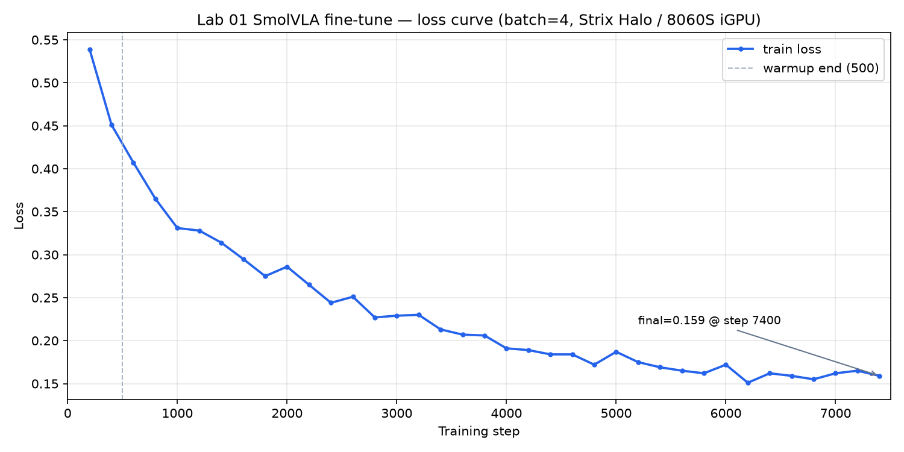
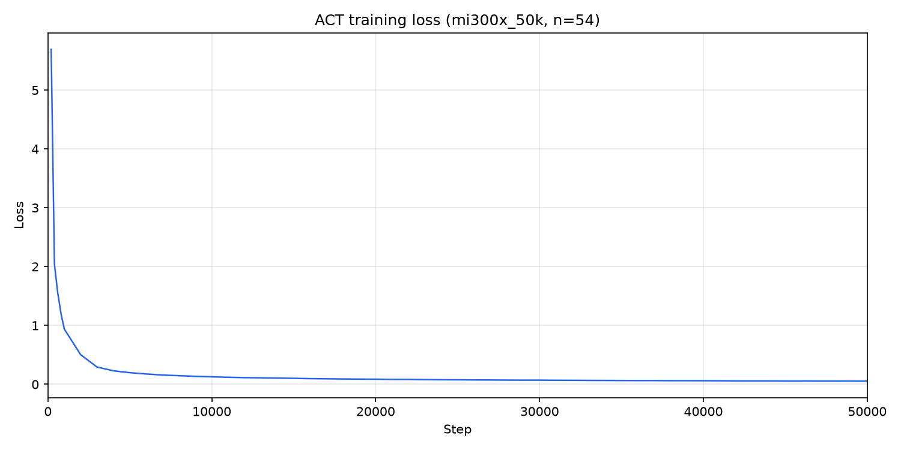

# 闭环打通：SO-101 SimStudio Lab 01 抓取放置（ROCm）

> Closing the Loop: SO-101 SimStudio Lab 01 Pick-and-Place on ROCm

**语言 / Language:** [中文](#中文) · [English](#english) · 📄 技术详解版 / Deep-dive

> ⚡ 只想 3 分钟快速了解？ → [**精简版 / Concise digest**](README.md)

> TL;DR：[SO-101 SimStudio](https://github.com/rocPAI-Forge/so101-simstudio) **v0.1.3** 提供 Lab 01：仿真示范（键盘 / Joy-Con / Leader）→ ACT / SmolVLA 训练 → MuJoCo sim2sim 评估。参考指标来自同一 50 集 PnP 数据上的 MI300X 50K 检查点。权威 runbook：[labs/lab01_pnp/lab01_pnp.md](https://github.com/rocPAI-Forge/so101-simstudio/blob/main/labs/lab01_pnp/lab01_pnp.md)。

> 系列上文：[项目介绍 v0.1.2](../so101-simstudio/README-details.md) · [站上精简版](https://rocpai-forge.github.io/en/posts/so101-simstudio/)

---

## 中文

### 0. 相对 v0.1.2 多了什么

v0.1.2 解决 **ROCm 上遥操作 + LeRobot v3.0 录制**。v0.1.3 把 ROADMAP 里的「行为克隆训练 / MuJoCo policy rollout」在 **Lab 01** 路径上落地：

- `labs/lab01_pnp/`：runbook、`_env.sh`、统一 `eval.cmd`、lab 内 eval YAML
- Hub 参考：数据集 + ACT + SmolVLA（示例账号 `alexhegit`，可用 `LAB01_*_HF_*` 换成自己的）
- 场景：wrist 相机对齐、cube/container 布局；数据集 id `so101-simstudio-lab01-pnp`

示范 **不绑定 Leader**：三种 teleop 共用录制管线；公开参考轨迹用 Leader 采，仅为数据质量示范。

### 1. 管线与布局原则

```
teleop (keyboard | joycon | leader)
        → LeRobot v3.0 dataset
        → lerobot-train (ACT | SmolVLA)
        → simstudio.scripts.eval (MuJoCo)
```

Lab 约定（可复用到后续 lab，允许因目标偏离并写明）：见 [labs/README.md](https://github.com/rocPAI-Forge/so101-simstudio/blob/main/labs/README.md)。

- **lab-bound**：`labs/lab01_pnp/configs/`（demo / fixed / rename_map）
- **foundational**：`configs/so101_mujoco_pick_leader.yaml` 等仍在仓库根

### 2. `reset_arm`（录制 vs 评估）

| 值 | 含义 | 典型场景 |
| --- | --- | --- |
| `follow` | 不瞬移到 home，保持当前关节角 | **Leader** 位置映射，避免第一帧猛拽 |
| `home` | 每局瞬移到固定 home | **键盘 / Joy-Con** |

Lab 01 **有意**在 eval YAML 里对照：SmolVLA → `home`，ACT → `follow`。比成功率时必须成对记录协议（runbook §6.2 / §6.4）。

### 3. 参考测量（证据）

同一 lab01-pnp 50 集、MI300X 50K 检查点（摘自 runbook §6.4）：

| Policy | Spawn | `reset_arm` | Inference | Success |
| --- | --- | --- | --- | --- |
| SmolVLA 50K | Full-range | `home` | RTC | **11/50 (22%)** |
| ACT 50K | Full-range | `follow` | Sync | **32/50 (64%)** · `n_action_steps=50` |
| ACT 50K | Fixed pose | `follow` | Sync | **8/10 (80%)** |





解读：本数据上 ACT 全范围明显强于 SmolVLA；收窄/固定 spawn 更适合演示，**不能**代替全范围泛化数字。

### 4. 复现（最短路径）

```bash
git clone --recursive https://github.com/rocPAI-Forge/so101-simstudio.git
cd so101-simstudio
git checkout release-v0.1.3
make rocm-sync && source .venv-rocm/bin/activate

# A) 只做 eval：按 Lab 01 §7 下载 Hub 数据集 + 权重，再：
./labs/lab01_pnp/eval.cmd

# B) 自己录（示例：键盘 / Joy-Con / Leader — 换配置或 --teleop.port）
./labs/lab01_pnp/record.cmd

# C) 训练（覆盖宏以匹配 GPU；见 runbook §5）
./labs/lab01_pnp/train.cmd
./labs/lab01_pnp/train_act.cmd
```

Hub 示例：

- Dataset: [alexhegit/so101-simstudio-lab01-pnp](https://huggingface.co/datasets/alexhegit/so101-simstudio-lab01-pnp)
- SmolVLA: [alexhegit/so101-simstudio-lab01-pnp-smolvla](https://huggingface.co/alexhegit/so101-simstudio-lab01-pnp-smolvla)
- ACT: [alexhegit/so101-simstudio-lab01-pnp-act](https://huggingface.co/alexhegit/so101-simstudio-lab01-pnp-act)

### 5. 破坏性变更（自 v0.1.2 脚本路径）

- 根目录 `configs/so101_mujoco_rollout*.yaml` → `labs/lab01_pnp/configs/rollout_*.yaml`
- `eval_act.cmd` 删除 → 统一 `eval.cmd` + `LAB01_POLICY_PATH` / `LAB01_EVAL_CONFIG`

完整说明见 [Release notes](https://github.com/rocPAI-Forge/so101-simstudio/releases/tag/release-v0.1.3)。

---

## English

### 0. What v0.1.3 adds beyond v0.1.2

v0.1.2 delivered **ROCm teleop + LeRobot v3.0 recording**. v0.1.3 lands BC training and MuJoCo policy rollout on the **Lab 01** path:

- `labs/lab01_pnp/` — runbook, `_env.sh`, unified `eval.cmd`, lab-local eval YAMLs
- Hub references — dataset + ACT + SmolVLA (example user `alexhegit`; override with `LAB01_*_HF_*`)
- Scene updates — wrist cam alignment, cube/container layout; dataset id `so101-simstudio-lab01-pnp`

Demos are **not leader-only**: all three teleop backends share the record pipeline. The public reference trajectories used a leader for quality; keyboard / Joy-Con work with the same lab scripts.

### 1. Pipeline and layout

```
teleop (keyboard | joycon | leader)
        → LeRobot v3.0 dataset
        → lerobot-train (ACT | SmolVLA)
        → simstudio.scripts.eval (MuJoCo)
```

Lab conventions (reusable; document deviations): [labs/README.md](https://github.com/rocPAI-Forge/so101-simstudio/blob/main/labs/README.md).

### 2. `reset_arm`

| Value | Meaning | Typical use |
| --- | --- | --- |
| `follow` | Do not teleport to home | **Leader** 1:1 mapping (avoid first-frame yank) |
| `home` | Teleport to fixed home each episode | **Keyboard / Joy-Con** |

Lab 01 **intentionally** contrasts eval YAMLs: SmolVLA → `home`, ACT → `follow`. Always pair metrics with protocol (§6.2 / §6.4).

### 3. Reference measurements

Same 50-episode lab01-pnp set, MI300X 50K checkpoints (from runbook §6.4):

| Policy | Spawn | `reset_arm` | Inference | Success |
| --- | --- | --- | --- | --- |
| SmolVLA 50K | Full-range | `home` | RTC | **11/50 (22%)** |
| ACT 50K | Full-range | `follow` | Sync | **32/50 (64%)** · `n_action_steps=50` |
| ACT 50K | Fixed pose | `follow` | Sync | **8/10 (80%)** |


On this data, ACT full-range ≫ SmolVLA; narrowed/fixed spawn helps demos but is **not** a substitute for full-range generalization numbers.

### 4. Reproduce (shortest path)

```bash
git clone --recursive https://github.com/rocPAI-Forge/so101-simstudio.git
cd so101-simstudio
git checkout release-v0.1.3
make rocm-sync && source .venv-rocm/bin/activate

./labs/lab01_pnp/eval.cmd          # after Hub download (§7)
./labs/lab01_pnp/record.cmd        # keyboard / Joy-Con / leader
./labs/lab01_pnp/train.cmd         # override LAB01_* for your GPU
./labs/lab01_pnp/train_act.cmd
```

### 5. Breaking changes

- Root rollout YAMLs moved under `labs/lab01_pnp/configs/`
- `eval_act.cmd` removed → unified `eval.cmd`

See [Release notes](https://github.com/rocPAI-Forge/so101-simstudio/releases/tag/release-v0.1.3).
