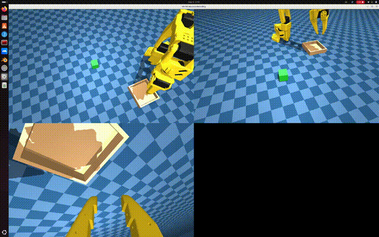

# 闭环打通：SO-101 SimStudio Lab 01 抓取放置（ROCm）

> Closing the Loop: SO-101 SimStudio Lab 01 Pick-and-Place on ROCm

**语言 / Language:** [中文](#中文) · [English](#english) · 📄 技术详解版 / Deep-dive

> ⚡ 只想快速了解？ → [**精简版 / Concise digest**](README.md)

> TL;DR：[SO-101 SimStudio](https://github.com/rocPAI-Forge/so101-simstudio) **v0.1.3** 提供 Lab 01：仿真示范（键盘 / Joy-Con / Leader）→ 模仿学习训练（ACT / SmolVLA）→ MuJoCo sim2sim 评估。参考指标来自同一 50 集 PnP 数据上的 MI300X 50K 检查点。权威 runbook：[labs/lab01_pnp/lab01_pnp.md](https://github.com/rocPAI-Forge/so101-simstudio/blob/main/labs/lab01_pnp/lab01_pnp.md)。

> 系列上文：[项目介绍 v0.1.2](../so101-simstudio/README-details.md) · [站上精简版](https://rocpai-forge.github.io/en/posts/so101-simstudio/)

---

## 中文

### 0. 相对 v0.1.2 多了什么

v0.1.2 解决 **ROCm 上遥操作 + LeRobot v3.0 录制**。v0.1.3 把 ROADMAP 里的「行为克隆训练 / MuJoCo policy rollout」在 **Lab 01** 路径上落地：

- `labs/lab01_pnp/`：runbook、`_env.sh`、统一 `eval.cmd`、lab 内 eval YAML
- Hub 参考：数据集 + ACT + SmolVLA（示例账号 `alexhegit`，可用 `LAB01_*_HF_*` 换成自己的）
- 场景：wrist 相机对齐、cube/container 布局；数据集 id `so101-simstudio-lab01-pnp`

示范 **不绑定 Leader**：三种 teleop 共用录制管线；公开参考轨迹用 Leader 采，仅为数据质量示范。

### 1. 模仿学习：作用、原理与三步流程

#### 为什么需要它

抓取放置这类接触丰富的操作，用几何脚本或硬编码状态机往往脆弱：光照、方块位姿、相机噪声一变就失效。**模仿学习（Imitation Learning）**把「会做任务的人」当成老师——用示范数据教策略，而不是先设计完美奖励或完整规划器。对 Physical AI / 机器人入门，它是最常见的 **record → train → eval** 闭环：先证明「能从演示学会」，再谈 RL 微调、更大 VLA、真机迁移。

Lab 01 用的是其中最直接的一类：**行为克隆（Behavior Cloning, BC）**——把专家轨迹当成监督学习标签。

#### 原理（直觉）

每一步，专家看到观测 \(o_t\)（关节状态、腕部/场景相机图像等），发出动作 \(a_t\)（关节目标或末端速度等）。策略 \(\pi_\theta(a \mid o)\) 在示范分布上最小化预测与 \(a_t\) 的差距（MSE、交叉熵、动作分块损失等，视 ACT / SmolVLA 而定）。

训练时策略是**开环拟合轨迹**；真正有用要看 **闭环 eval**：策略自己的动作会改变下一帧观测，误差会累积（covariate shift）。所以必须：

1. 示范尽量覆盖任务变化（方块位置、接触失败后的恢复姿态等）；
2. 用 MuJoCo 闭环评估，而不是只看训练 loss。

ACT 预测一段动作 chunk；SmolVLA 走视觉–语言–动作路线。二者都是「从演示学控制」，实现与容量不同——Lab 01 用**同一份数据**对照，方便理解数据量与任务难度对策略族的影响。

#### 流程如何落到 Lab 01

```
① 数据抓取          ② Policy 训练           ③ Eval
teleop → LeRobot   lerobot-train (BC)    策略闭环 → 成功率
v3.0 数据集         ACT | SmolVLA         MuJoCo + 任务判据
```

| 步骤 | Lab 01 入口 | 产出 / 判据 |
| --- | --- | --- |
| **数据抓取** | `record.cmd` + 键盘 / Joy-Con / Leader | 每集：观测流 + 动作流；可推到 Hub |
| **Policy 训练** | `train.cmd` / `train_act.cmd` | checkpoint；loss 曲线（见下图） |
| **Eval** | `eval.cmd` + lab YAML | 方块是否入盒等成功标准（runbook §6） |

旋钮集中在 `_env.sh`（`LAB01_*`）。没有「第三步」，模仿学习闭环就不完整——训练 loss 下降只说明拟合了示范，不代表会抓。

### 2. 管线与布局原则

```
teleop (keyboard | joycon | leader)
        → LeRobot v3.0 dataset
        → lerobot-train (ACT | SmolVLA)
        → simstudio.scripts.eval (MuJoCo)
```

Lab 约定（可复用到后续 lab，允许因目标偏离并写明）：见 [labs/README.md](https://github.com/rocPAI-Forge/so101-simstudio/blob/main/labs/README.md)。

- **lab-bound**：`labs/lab01_pnp/configs/`（demo / fixed / rename_map）
- **foundational**：`configs/so101_mujoco_pick_leader.yaml` 等仍在仓库根

### 3. `reset_arm`（录制 vs 评估）

| 值 | 含义 | 典型场景 |
| --- | --- | --- |
| `follow` | 不瞬移到 home，保持当前关节角 | **Leader** 位置映射，避免第一帧猛拽 |
| `home` | 每局瞬移到固定 home | **键盘 / Joy-Con** |

Lab 01 **有意**在 eval YAML 里对照：SmolVLA → `home`，ACT → `follow`。比成功率时必须成对记录协议（runbook §6.2 / §6.4）。

### 4. 参考测量（证据）

同一 lab01-pnp 50 集、MI300X 50K 检查点（摘自 runbook §6.4）：

| Policy | Spawn | `reset_arm` | Inference | Success |
| --- | --- | --- | --- | --- |
| SmolVLA 50K | Full-range | `home` | RTC | **11/50 (22%)** |
| ACT 50K | Full-range | `follow` | Sync | **32/50 (64%)** · `n_action_steps=50` |
| ACT 50K | Fixed pose | `follow` | Sync | **8/10 (80%)** |


解读：本数据上 ACT 全范围明显强于 SmolVLA；收窄/固定 spawn 更适合演示，**不能**代替全范围泛化数字。Loss 只能说明 BC 拟合进度；上表才是模仿学习闭环里的任务级证据。

### 4.1 Eval GUI 片段

固定位姿 ACT 闭环录屏（约 1:12–1:43 裁剪，1.5× 加速，960p）——策略在无人类输入下完成抓取放置：



- 视频：[`assets/videos/eval-act-pnp.mp4`](assets/videos/eval-act-pnp.mp4)
- 配置：`rollout_act_demo_fixed.yaml`，`n_action_steps=100`，本地 `checkpoints/last`

### 5. 复现（最短路径）

```bash
git clone --recursive https://github.com/rocPAI-Forge/so101-simstudio.git
cd so101-simstudio
git checkout release-v0.1.3
make rocm-sync && source .venv-rocm/bin/activate

# A) 只做 eval：按 Lab 01 §7 下载 Hub 数据集 + 权重，再：
./labs/lab01_pnp/eval.cmd

# B) 自己录（示例：键盘 / Joy-Con / Leader — 换配置或 --teleop.port）
./labs/lab01_pnp/record.cmd

# C) 训练（覆盖宏以匹配 GPU；见 runbook §5）
./labs/lab01_pnp/train.cmd
./labs/lab01_pnp/train_act.cmd
```

Hub 示例：

- Dataset: [alexhegit/so101-simstudio-lab01-pnp](https://huggingface.co/datasets/alexhegit/so101-simstudio-lab01-pnp)
- SmolVLA: [alexhegit/so101-simstudio-lab01-pnp-smolvla](https://huggingface.co/alexhegit/so101-simstudio-lab01-pnp-smolvla)
- ACT: [alexhegit/so101-simstudio-lab01-pnp-act](https://huggingface.co/alexhegit/so101-simstudio-lab01-pnp-act)

### 6. 破坏性变更（自 v0.1.2 脚本路径）

- 根目录 `configs/so101_mujoco_rollout*.yaml` → `labs/lab01_pnp/configs/rollout_*.yaml`
- `eval_act.cmd` 删除 → 统一 `eval.cmd` + `LAB01_POLICY_PATH` / `LAB01_EVAL_CONFIG`

完整说明见 [Release notes](https://github.com/rocPAI-Forge/so101-simstudio/releases/tag/release-v0.1.3)。

---

## English

### 0. What v0.1.3 adds beyond v0.1.2

v0.1.2 delivered **ROCm teleop + LeRobot v3.0 recording**. v0.1.3 lands BC training and MuJoCo policy rollout on the **Lab 01** path:

- `labs/lab01_pnp/` — runbook, `_env.sh`, unified `eval.cmd`, lab-local eval YAMLs
- Hub references — dataset + ACT + SmolVLA (example user `alexhegit`; override with `LAB01_*_HF_*`)
- Scene updates — wrist cam alignment, cube/container layout; dataset id `so101-simstudio-lab01-pnp`

Demos are **not leader-only**: all three teleop backends share the record pipeline. The public reference trajectories used a leader for quality; keyboard / Joy-Con work with the same lab scripts.

### 1. Imitation learning: role, idea, and the three-step loop

#### Why it matters

Contact-rich pick-and-place is brittle if you hard-code geometry or a fragile state machine — lighting, cube pose, and camera noise break scripts quickly. **Imitation learning** treats a skilled teleoperator as the teacher: learn from demos instead of inventing a perfect reward or planner first. For Physical AI / robot starters, the standard closed loop is **record → train → eval**: prove “learnable from demos,” then consider RL fine-tuning, larger VLAs, or real-robot transfer.

Lab 01 uses the most direct flavor: **behavior cloning (BC)** — expert trajectories as supervised labels.

#### Core idea

At each step the expert sees observation \(o_t\) (joint state, wrist/scene images, …) and produces action \(a_t\) (joint targets or end-effector rates). Policy \(\pi_\theta(a \mid o)\) minimizes the gap to \(a_t\) on the demo distribution (MSE, CE, action-chunk losses — depending on ACT / SmolVLA).

Training fits trajectories **open-loop**; what matters is **closed-loop eval**: the policy’s own actions change the next observation, and errors compound (covariate shift). So you need:

1. Demos that cover task variation (cube spawn, recovery after near-misses, …);
2. MuJoCo closed-loop scoring — not training loss alone.

ACT predicts action chunks; SmolVLA follows a vision–language–action path. Both learn control from demos with different capacity. Lab 01 trains them on the **same** dataset so you can see how data scale and task difficulty hit each family.

#### How the loop maps onto Lab 01

```
① Data collection     ② Policy training        ③ Eval
teleop → LeRobot     lerobot-train (BC)      policy closed loop
v3.0 dataset          ACT | SmolVLA           MuJoCo + success criteria
```

| Step | Lab 01 entry | Output / criterion |
| --- | --- | --- |
| **Data collection** | `record.cmd` + keyboard / Joy-Con / leader | Episodes: observations + actions; optional Hub upload |
| **Policy training** | `train.cmd` / `train_act.cmd` | Checkpoints; loss curves (figures below) |
| **Eval** | `eval.cmd` + lab YAMLs | Task success (cube in container, …) — runbook §6 |

Knobs live in `_env.sh` (`LAB01_*`). Without step ③, the IL loop is incomplete — lower loss only means “fit the demos,” not “can pick.”

### 2. Pipeline and layout

```
teleop (keyboard | joycon | leader)
        → LeRobot v3.0 dataset
        → lerobot-train (ACT | SmolVLA)
        → simstudio.scripts.eval (MuJoCo)
```

Lab conventions (reusable; document deviations): [labs/README.md](https://github.com/rocPAI-Forge/so101-simstudio/blob/main/labs/README.md).

### 3. `reset_arm`

| Value | Meaning | Typical use |
| --- | --- | --- |
| `follow` | Do not teleport to home | **Leader** 1:1 mapping (avoid first-frame yank) |
| `home` | Teleport to fixed home each episode | **Keyboard / Joy-Con** |

Lab 01 **intentionally** contrasts eval YAMLs: SmolVLA → `home`, ACT → `follow`. Always pair metrics with protocol (§6.2 / §6.4).

### 4. Reference measurements

Same 50-episode lab01-pnp set, MI300X 50K checkpoints (from runbook §6.4):

| Policy | Spawn | `reset_arm` | Inference | Success |
| --- | --- | --- | --- | --- |
| SmolVLA 50K | Full-range | `home` | RTC | **11/50 (22%)** |
| ACT 50K | Full-range | `follow` | Sync | **32/50 (64%)** · `n_action_steps=50` |
| ACT 50K | Fixed pose | `follow` | Sync | **8/10 (80%)** |


On this data, ACT full-range ≫ SmolVLA; narrowed/fixed spawn helps demos but is **not** a substitute for full-range generalization numbers. Loss tracks BC fit; the table is the task-level evidence for the IL loop.

### 4.1 Eval GUI clip

Fixed-pose ACT closed-loop screencast (trim ~1:12–1:43, 1.5×, 960p) — policy completes pick-and-place with no human input:


- Video: [`assets/videos/eval-act-pnp.mp4`](assets/videos/eval-act-pnp.mp4)
- Config: `rollout_act_demo_fixed.yaml`, `n_action_steps=100`, local `checkpoints/last`

### 5. Reproduce (shortest path)

```bash
git clone --recursive https://github.com/rocPAI-Forge/so101-simstudio.git
cd so101-simstudio
git checkout release-v0.1.3
make rocm-sync && source .venv-rocm/bin/activate

./labs/lab01_pnp/eval.cmd          # after Hub download (§7)
./labs/lab01_pnp/record.cmd        # keyboard / Joy-Con / leader
./labs/lab01_pnp/train.cmd         # override LAB01_* for your GPU
./labs/lab01_pnp/train_act.cmd
```

### 6. Breaking changes

- Root rollout YAMLs moved under `labs/lab01_pnp/configs/`
- `eval_act.cmd` removed → unified `eval.cmd`

See [Release notes](https://github.com/rocPAI-Forge/so101-simstudio/releases/tag/release-v0.1.3).
